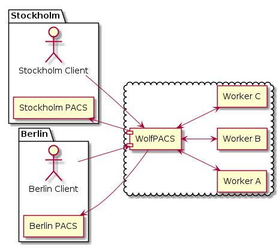

# WolfPACS


[](https://codecov.io/gh/wolfpacs/wolfpacs?branch=master)
[](https://hub.docker.com/r/wolfpacs/wolfpacs)
[](https://www.gnu.org/licenses)
[](https://wolfpacs.github.io/wolfpacs/)
[](https://semver.org/)


## Raison d'être

With the advent of powerful AI solutions in Radiology,
there is growing need to split the workload across multiple workers.
**WolfPACS** acts as a load balancer, sending DICOM series to the correct worker.

## Mission statement

> Enable a pool of heterogeneous workers (hardware, software) to serve multiple clients in a flexible way.

## Status

**WolfPACS** is currently in the **Alpha** phase of development.
Some critical bugs may still remain in the software.

**WolfPACS** is close to feature freeze but is open for adjustments upon feedback.

**WolfPACS** needs more black-box testing. If you have a use case please write raphexion+wolfpacs@gmail.com.

## Bird's-eye view

Imagine a Medical AI company called __Stroke Insight__.
They have developed a cutting-edge algorithm to analyse MRIs; to detect strokes.
To analyse the images, they need computers with a lot of GPU power.
These are critical resource, that need serve many clients concurrently.
The machines are called **workers**.
Once in a while they need to take the workers offline in order to upgrade the software and/or the hardware.
To server multiple clients in a flexible way, they have deployed **WolfPACS** as a loadbalancer.

Two clients, a hosptial in Stockholm and one in Berlin as bought their newest version of their software.
Let's call them Stockholm Hospital (S) and Berlin Hospital (B).
Both Stockholm and Berlin have their own central PACS systems.

To run their algorithm, __Stroke Insight__ needs to get the original images to generate the extra information; the **derived series**.



Steps in figure above.

1. A Radiologist sends the primary series to __Stroke Insight__ (which are running WolfPACS as a loadbalancer.)
2. WolfPACS receives the series and routes the images to an appropriate worker with the right software [1].
3. The worker sends the new derived series back to WolfPACS.
4. Finally, WolfPACS sends the new series back to the correct destination.

[1] A series is contains many imanges and WolfPACS makes sure that the whole series ends up on the same worker.

## Mental model

Any router / load balancer has two sides.
One side facing the outside world.
And the other side facing the inside world (workers).

We expose port 11112 for outside clients of WolfPACS.
Workers on the other side, should contact WolfPACS on port 11113.

Therefore, if you deploy WolfPACS, you need to expose 11112 to the outside world.
Whereas you want to keep 11113 open inside the firewall (trusted side).


In addition, WolfPACS is best configured using HTTP.
WolfPACS listens on port 8080.

Please see  for an example python script.

## Client vs Destination

A client is anyone with the correct Application Entity (AE). This acts as a shared secret / password.

A destionation is a server that can receive DICOM data.
WolfPACS needs a hostname, IP-address and called AE.

So the client will send data to WolfPACS and the destination will receive data from WolfPACS.

## Quick Start

Start WolfPACS in background.

```sh
docker run -d -p 11112:11112 -p 11113:11113 -p 8080:8080 wolfpacs/wolfpacs
```

Configure WolfPACS to have 2 workers, 1 client and 1 destination.

```sh
python3 mini_admin.py --add-worker --name w1 --host 192.168.1.11 --port 1111 --ae W1
python3 mini_admin.py --add-worker --name w2 --host 192.168.1.12 --port 2222 --ae W2

python3 mini_admin.py --add-client --name c1 --ae C1111

python3 mini_admin.py --add-dest --name c1 --host 1.2.3.4 --port 1234 --ae D1111

python3 mini_admin.py --assoc-worker --client c1 --name w1
python3 mini_admin.py --assoc-worker --client c1 --name w2

python3 mini_admin.py --assoc-dest --client c1 --name d1
```

Debug WolfPACS instance

```sh
docker run -it -p 11112:11112 -p 11113:11113 -p 8080:8080 wolfpacs/wolfpacs console
```

## Environment variables

It is possible to configure some parts of WolfPACS using environmental variables.

| Variable              | Description                           | Default |
|-----------------------|---------------------------------------|---------|
| WOLFPACS_INSIDE_PORT  | The port towards the workers          | 11112   |
| WOLFPACS_OUTSIDE_PORT | The port facing the outside world     | 11113   |
| WOLFPACS_ADMIN_PORT   | The port for administration over http | 8080    |

## DICOM Conformance Statement

The following transfer syntax are are supported:

| Transfer Syntax           | UID                 | Supported |
| ------------------------- | ------------------- | --------- |
| Implicit VR Little Endian | 1.2.840.10008.1.2   | Yes       |
| Explicit VR Little Endian | 1.2.840.10008.1.2.1 | Yes       |
| Explicit VR Big Endian    | 1.2.840.10008.1.2.2 | Yes       |

## Test plan

A PACS is classified as a medical device and needs to be painstakingly tested.

We use four different test in WolfPACS and we aim to test the software thoroughly.

| Test                   | Target                | Method                                                                           |
| ---------------------- | --------------------- | -------------------------------------------------------------------------------- |
| Unit tests             | One Module            | [Erlang Eunit](http://erlang.org/doc/apps/eunit/chapter.html)                    |
| Integration tests      | Many Modules          | [Erlang Common Tests](https://erlang.org/doc/apps/common_test/introduction.html) |
| Validation testing     | User requirements     | [Python Robot Framework](https://robotframework.org/)                            |
| Property based testing | Hidden bugs / Fussing | [Erlang proper](https://propertesting.com/)                                      |
