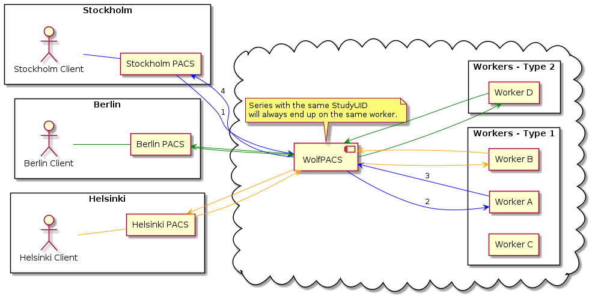

# WolfPACS

[](https://travis-ci.org/wolfpacs/wolfpacs)
[](https://codecov.io/gh/wolfpacs/wolfpacs?branch=master)
[](https://hub.docker.com/r/wolfpacs/wolfpacs)
[](https://www.apache.org/licenses/LICENSE-2.0)


WolfPACS is an DICOM router and open-source Picture Archiving and Communication System (PACS) solution written in Erlang.

## Raison d'être

With the advent of heavy ML/AI solutions in Radiology,
there is growing need to split the workload across multiple workers.
**WolfPACS** acts as a router, sending DICOM series to the correct worker.

## Status

**WolfPACS** is under active development and not ready for production.

## WolfPACS's vision

Imagine two hospitals that need help with processing data.
Let's call them Stockholm Hospital (S) and Berlin Hospital (B).
Both Stockholm and Berlin have their own central PACS systems.
Let's call them S-PACS and B-PACS.

A medical company provides software that can provide extra information
(derived series) to a medical study. Their software is running on external
computers (called workers).



The key contribution of the WolfPACS router is front multiple workers,
spread the load and return the processed dicom files to the correct PACS.

To clarify the situation, let's create an example table of all the relevant components.

| Name     | Host         | Port  | Calling AE | Called AE | WolfPACS Role | Note                                                           |
| -------- | ------------ | ----- | ---------- | --------- | ------------- | -------------------------------------------------------------- |
| S-Client | N/A          | N/A   | S-CLIENT   | S-PASS    | Server        | A Radiologist sends a study to WolfPACS for further processing |
| B-Client | N/A          | N/A   | B-CLIENT   | B-PASS    | Server        |                                                                |
| Worker A | 192.168.0.10 | 11112 | WolfPACS   | WORKER-A  | Client        | A worker that will process a study and generate derived series |
| Worker B | 192.168.0.11 | 11113 | WolfPACS   | WORKER-B  | Client        |                                                                |
| Worker C | 192.168.0.12 | 11114 | WolfPACS   | WORKER-C  | Client        |                                                                |
| S-PACS   | s.com        | 11110 | WolfPACS   | ABCD      | Client        | A PACS system in the hospital that recieves the derived series |
| B-PACS   | b.com        | 11111 | WolfPACS   | EFGH      | Client        |                                                                |

## Test plan

A PACS is classified as a medical device and needs to be painstakingly tested.

We use four different test in WolfPACS and we aim to test the software thoroughly.

| Test                   | Target                | Method                                                                           |
| ---------------------- | --------------------- | -------------------------------------------------------------------------------- |
| Unit tests             | One Module            | [Erlang Eunit](http://erlang.org/doc/apps/eunit/chapter.html)                    |
| Integration tests      | Many Modules          | [Erlang Common Tests](https://erlang.org/doc/apps/common_test/introduction.html) |
| Validation testing     | User requirements     | [Python Robot Framework](https://robotframework.org/)                            |
| Property based testing | Hidden bugs / Fussing | [Erlang proper](https://propertesting.com/)                                      |

## Quick Start

Start WolfPACS in background.

```sh
docker run -d -p 11112:11112 wolfpacs/wolfpacs
```

Debug WolfPACS instance

```sh
docker run -it -p 11112:11112 wolfpacs/wolfpacs console
```

## Configuration

```
# wolfpacs.conf

# Add worker (s)
# A worker is an "internal" machine that may do some processing on DICOM files.
# The specification is: {worker, <host>, <port>, <ae>}
# The worker should reply to wolfpacs on port 11113 (default).

{worker, "localhost", 1234, "WORKER"}.

# Add destination(s)
# A destination is an "external" machine that will recieve the final
# series that where created by the worker.
# The specification is: {destination, {<called AE>, <calling AE>}, <destination-host>, <destination-port>}
# The destination should be prepared to answer and receive data on <host> and <port>.
# The <called AE> and <calling AE> acts as a "key"/"authorization"/"routing" pair.
# Especially, it is the original call to wolfpacs that uses this pair.
#
# dcmsend -aec WOLFPACS -aet DCMSEND <wolfpacs-host> <wolfpacs-port>

{destination, {"WOLFPACS", "DCMSEND"}, "pacs.example.com", 11112}.
```

```sh
docker run -d -v /a/path/config/folder:/app123 -e WOLFPACS_DIR=/app123 -p 11112:11112 wolfpacs/wolfpacs
```

## DICOM Conformance Statement

The following transfer syntax are are supported:

| Transfer Syntax           | UID                 | Supported |
| ------------------------- | ------------------- | --------- |
| Implicit VR Little Endian | 1.2.840.10008.1.2   | Yes       |
| Explicit VR Little Endian | 1.2.840.10008.1.2.1 | Yes       |
| Explicit VR Big Endian    | 1.2.840.10008.1.2.2 | Yes       |

The following services are supported:

| Name         | UID               | SCP       | SCU       |
| ------------ | ----------------- | --------- | --------- |
| Verification | 1.2.840.10008.1.1 | Yes (PoC) | Yes (PoC) |

## Links and references

[How to Write Erlang Documentation](https://docs.2600hz.com/dev/doc/engineering/erlang-documentation/)

[DICOM Validator](https://www.dclunie.com/dicom3tools/dciodvfy.html)
